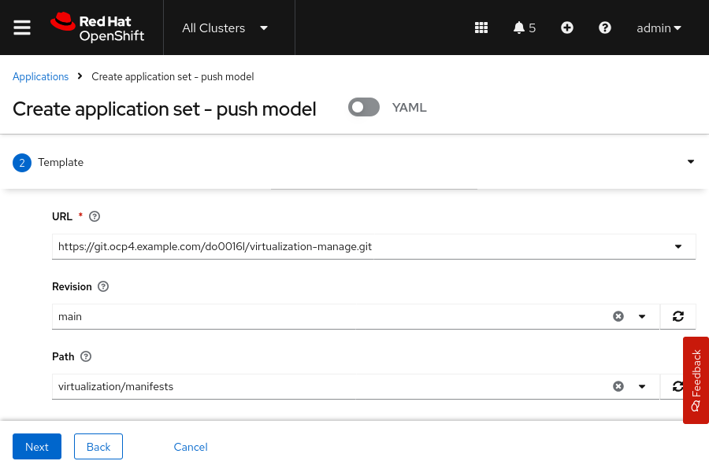

---
# Deploy and Manage Multicluster Virtual Machines with RHACM

Outcomes

Create an application set to deploy a VM to the clusters in the configured cluster set.

Use the VMs page to perform VM operations.

Instructions

The lab start command deploys the GitOps operator, installs the OpenShift Virtualization operator, and creates a cluster set named gitops-configure that contains the hub cluster and the managed cluster.

Log in to the RHOCP hub cluster, and switch to the RHACM web console.

Open a web browser and go to https://console-openshift-console.apps.ocp4.example.com

Select the Red Hat Identity Management identity provider and log in as the admin user with redhatocp as the password.

Ensure that the cluster switcher is set to All Clusters, which corresponds to the RHACM web console.

Create an application set to deploy VMs from a Git repository.

Go to Applications and select Create application → Argo CD ApplicationSet - Push model.

Set the name of the application to virtualization-manage, select the openshift-gitops Argo CD server, leave the default value for Requeue, and click Next.

Configure the Git repository as follows, and click Next.

**Parameter**	**Value**

Type:	Git

URL:	https://git.ocp4.example.com/do0016l/virtualization-manage.git

Revision:	main

Path:	virtualization/manifests

Remote namespace:	virt-manage

